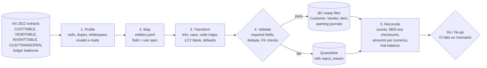

# ERP Migration Toolkit: Dynamics AX → Dynamics 365 Business Central

**A reusable, test-driven framework to profile, map, transform and *prove* an ERP data migration: every source record is accounted for and every rupee reconciles.**

[](https://github.com/Shashan4321/erp-migration-toolkit-ax-to-d365/actions/workflows/ci.yml)


> **Business problem.** ERP migrations fail quietly: a few duplicate customers, orphaned invoices or a rounding difference in opening balances, and finance cannot close the first month on the new system. This toolkit makes the migration **auditable**: mapping lives in a reviewable spec, bad records are quarantined with a reason, and a reconciliation report gates go-live.

| | |
|---|---|
| **Stack** | Python · pandas · YAML mapping specs · pytest · GitHub Actions |
| **Skills shown** | ERP data migration · data profiling · data quality rules · source-to-target mapping · reconciliation & controls · runbooks · stakeholder sign-off |
| **Data** | Synthetic AX-style extracts generated with Faker (see [Data & license](#data--license)) |

## How it works



## In this project

Computed by `make all` on the seeded synthetic extract; the committed [`reports/`](reports/) folder is the actual output.

| Entity | Source rows | Loaded | Quarantined | Why quarantined |
|---|---:|---:|---:|---|
| Customer | 606 | 600 | 6 | duplicates after trim/upper (e.g. `c00123 ` vs `C00123`) |
| Vendor | 150 | 150 | 0 | |
| Item | 400 | 400 | 0 | 5 missing units of measure defaulted to `PCS` by the `default_pcs` rule |
| Open customer invoices | 1,800 | 1,796 | 4 | orphans: customer `C99999` does not exist |
| G/L opening balances | 39 | 39 | 0 | |

**Reconciliation: 14/14 checks pass.** 0 records unaccounted for. Open-invoice totals match per currency (AED, USD, LCY): loaded + quarantined = source, to the paisa. The trial balance matches per account and nets to 0.00. A test deliberately changes one invoice by ₹1.00 and confirms the reconciliation catches it.

**Profiling found:** 6 duplicate customer keys, 9 mixed-case/space-padded posting groups, 8 missing currencies, 8 invalid e-mails, 5 items without a unit of measure, 29 invoices without a currency code. See [`reports/profiling.md`](reports/profiling.md).

## Mapping spec (excerpt)

The whole AX → BC mapping is data, not code: [`mappings/entities.yaml`](mappings/entities.yaml). A functional consultant can review it without reading Python.

```yaml
customer:
  source: CUSTTABLE
  target: Customer              # BC table 18
  fields:
    "No.":                     {from: ACCOUNTNUM, rules: [trim, upper]}
    "Customer Posting Group":  {from: CUSTGROUP,  rules: [trim, upper, map_posting_group]}
    "Currency Code":           {from: CURRENCY,   rules: [trim, upper, lcy_blank]}
    "E-Mail":                  {from: EMAIL,      rules: [trim, lower, valid_email_or_blank]}
    "Blocked":                 {from: BLOCKED,    rules: [map_blocked]}   # 0/1/2 -> ""/Invoice/All
  required: ["No.", "Name", "Customer Posting Group"]
open_invoice:
  foreign_keys: {"Customer No.": customer}
```

## Reconciliation checks

| Check | What it proves |
|---|---|
| Row accounting | `source = loaded + quarantined` for every entity: nothing silently dropped |
| Key checksum (MD5 of sorted normalised keys) | Keys were not altered; catches cases where counts match by coincidence |
| Amount totals per currency | AR open items: `loaded + quarantined = source` to 0.01 |
| G/L per-account totals + trial balance = 0 | Opening balances post cleanly; finance can sign off |

## Quick start

```bash
git clone https://github.com/Shashan4321/erp-migration-toolkit-ax-to-d365.git
cd erp-migration-toolkit-ax-to-d365
pip install -r requirements-dev.txt
make all          # generate -> profile -> migrate -> reconcile (exit 1 on any mismatch)
make test         # 13 tests incl. a tamper test
```

Outputs: `data/target_bc/*.csv` (BC-ready), `data/rejects/*.csv`, `reports/profiling.md`, `reports/reconciliation.md`.

## Project structure

```text
├── mappings/entities.yaml       # source-to-target spec (AX -> BC field names)
├── src/erpmig/
│   ├── generate_ax.py           # synthetic AX extracts with injected data-quality issues
│   ├── profile.py               # profiling report
│   ├── rules.py                 # cleansing rules referenced by the spec
│   ├── migrate.py               # transform + validate + quarantine
│   └── reconcile.py             # controls + report; non-zero exit on failure
├── reports/                     # committed output of the last run
├── docs/runbook.md              # cut-over plan, sign-off criteria, rollback points
├── tests/                       # pytest incl. tamper detection
└── .github/workflows/ci.yml     # runs the full migration and uploads the reports
```

## Runbook

[`docs/runbook.md`](docs/runbook.md) covers freeze → extract → load → reconcile → sign-off → hypercare, with rollback points and the go-live checklist finance signs.

## Data & license

* **Data:** 100% synthetic. AX table and column names follow Microsoft's public AX 2012 data dictionary; all values come from [Faker](https://faker.readthedocs.io) (seed 7). No employer or client data, schema, screenshots or code are used.
* **Code:** MIT License.

## Author

**Shashank Singh**, Senior Data Analyst · [Portfolio](https://shashan4321.github.io) · [LinkedIn](https://www.linkedin.com/in/shashank-moon)

*Professional impact:* led a full Dynamics AX → Dynamics 365 Business Central data migration with zero data loss. This repo rebuilds the approach as an open, reusable framework.
